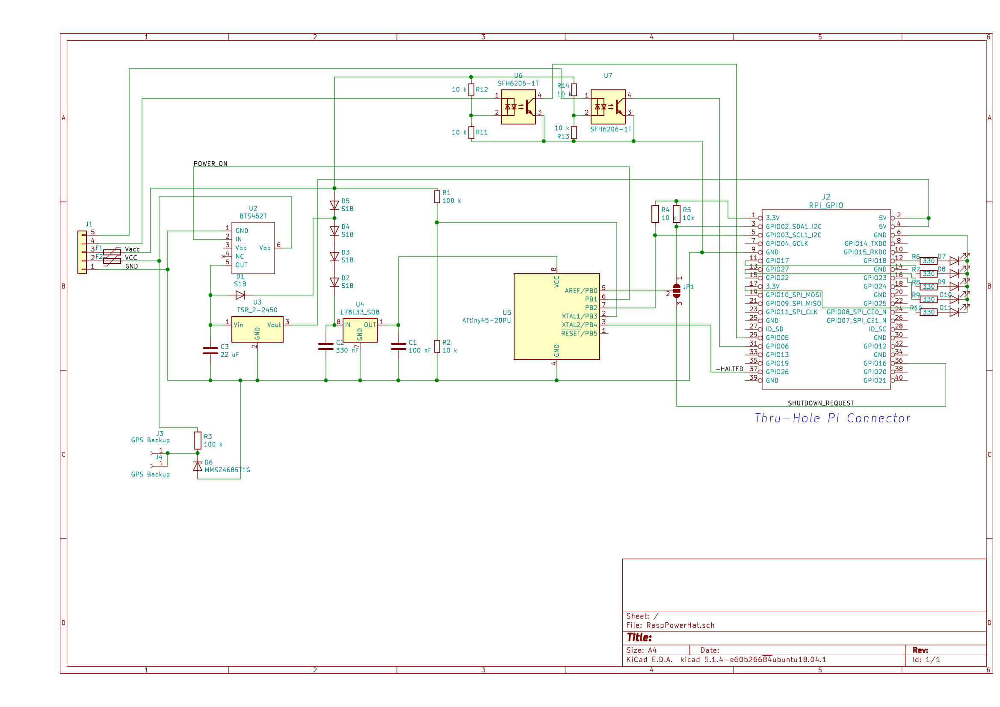

This folder contains definition of the electronic part of the Hat. 
Files can be edited with [Kicad PCB](http://www.kicad-pcb.org/) ,a Cross Platform and Open Source Electronics Design Automation Suite .

Some explanation :
- U2 BTS452T is a Smart Power Switch to power the PI through the Traco regulator TSR 2-2450. C3 is not mandatory but recommended by the Traco application note if input voltage of 24V is used. 
- D1 and D5 are to power the 78L33 regulator and then the arduino ATTINY 45 from Vacc or from the U2 power switch.
- In case of usage with a 24V car battery, in charge voltage can grow up to 28 V (normal operation) or even 32 V (overvoltage situation). D2, D3, D4 are there to protect the 78L33 input (maximun rating 30V) in this case.
- R1 are R2 are a divider to provide Vacc voltage information to the ATTINY 45 through  analog input AN3.
- R4, R5 are pull-up for communication I2C bus between the ATTINY 45 and the PI
- JP1 : pin 1 and 2 need to be shorten as the SHUTDOWN request is now done through the I2C bus and not through a dedicated digital input
- J3, J4, R3, D6 are not necessary for a generci usage and were dedicated to data saving of GPS chipset
- R11, R12, R13, R14, U6, U7 are there for additionnal isolated input. But I've never sold neither tested them. Forget them.

References of used components can be browse by opening schematic file (RaspPowerHat.sch) with KiCad PCB.
