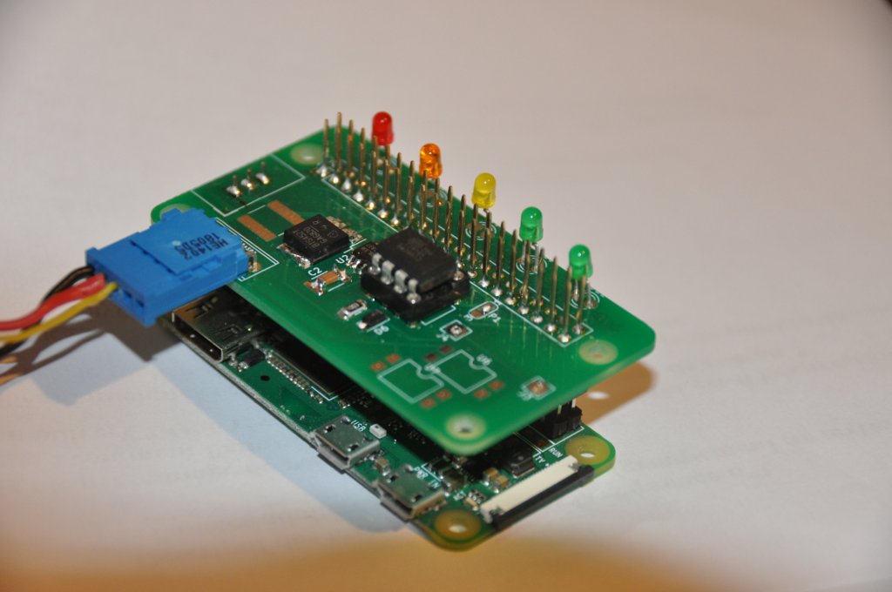
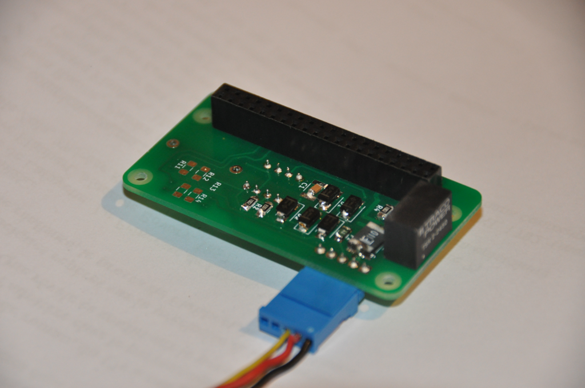

# RaspPowerHat
A raspberry hat designed to manage raspberry powering from a car battery. 
The purpose of the hat is to switch on the RaspBerry when car accessory power is switched on (easy ;-) ) and to switch it off properly (after linux shutdown ) when the car accessory power is switched off (more difficult).

To achieve this objective, the raspberry itself is powered by a permanent +12V power line through a 5V step down converter. A connection to ACC power supply (switched ignition) allow to switch on and later off the raspberry. 

The PCB is designed to fit well on a Raspberry PI Z but can also be used on Raspberry 2 or 3. 

Black wire is for ground, red for permanent 12 to 24 V, yellow is for accessories ON or ignition On information

One limitation is the output current of the 5V converter which is 2A. This is the biggest converter I found which can be soldered on the back of the PCB.

